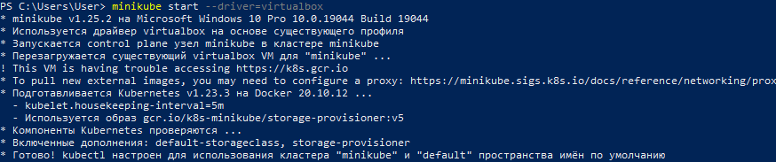
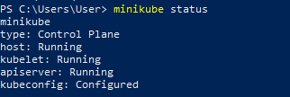
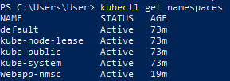
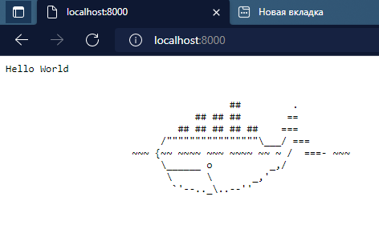
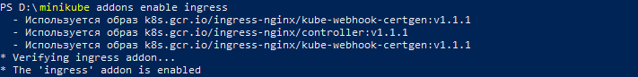
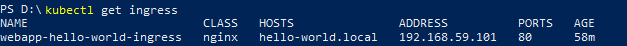
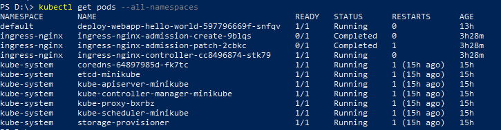
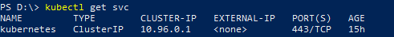
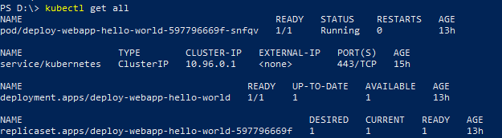

Kubernetes

<!-- Description -->
<details open="open">
  <summary>Description</summary>
  <ol>
    <li>
      <a href="#Установите-minikube-согласно-инструкции-на-официальном-сайте">Minikube installation;</a>
    </li>
    <li>
      <a href="#Создайте-namespace-для-деплоя-простого-веб-приложения">Create namespace to deploy web app;</a>
    </li>
    <li><a href="#Напишите-deployments-файл-для-установки-в-Kubernetes-простого-веб-приложения">Create deployments file to install web app in Kubernetes, for example https://github.com/crccheck/docker-hello-world;</a></li>
    <li><a href="#Установите-в-кластер-ingress-контроллер">Install an ingress controller in the cluster;</a></li>
    <li><a href="#Напишите-и-установите-Ingress-rule-для-получения-доступа-к-своему-приложению.">Write and install Ingress rule to get access to the app.</a></li>
  </ol>
</details>


<!-- INSTALL MINIKUBE -->
## Minikube installation (according to the instructions on the official website).
  1. Kubectl installation.
  2. Hyper-V, VirtualBox installation.
  3. Minikube manual installation. Minikube-windows-amd64 loading, renameing in minikube.exe,  adding to executable directory.
  4. Check correct loading of Hyper-V, Minikube. Use a command that starts the local cluster Kubernetes:
      ```sh
       minikube start --vm-driver=<driver_name>
      ```
      где --vm-driver=<enter_driver_name> - virtual machine driver.
  <p align="left">
  <a href="https://github.com/DmitryBond/WorkWithKubernetes/blob/main/images/start_kube.PNG">
    
  </a>
  <p align="left">
  
   5. After the minikube start command was successful, start command for checking the status of the cluster:
      ```sh
      minikube status
      ```
      <p align="left">
  <a href="https://github.com/DmitryBond/WorkWithKubernetes/blob/main/images/minikube_status.PNG">
    
  </a>
  <p align="left">
    
     The cluster works, Minikube is running.
    
    
   
<!-- CREATE NAMESPACE DEPLOY -->
## Create namespace to deploy web app.
    
  Create an object namespace  `web-namespace.yaml`
   ```JS
apiVersion: v1
kind: Namespace
metadata:
  name: webapp-nmsc
  labels:
    app: web
   ```
  <p align="left">
  <a href="https://github.com/DmitryBond/WorkWithKubernetes/blob/main/images/get_namespaces.PNG">
    
  </a>
  <p align="left">

    
<!-- FILE FOR INSTALL WEB -->    
## Create deployments file to install web app in Kubernetes.
    
  Create a manifesto file for deployment `deploy-hello-world.yaml`
   ```JS
apiVersion: apps/v1
kind: Deployment
metadata:
  name: deploy-webapp-hello-world
  labels:
    app: web
spec:
  selector:
    matchLabels:
      project: dwhw
  template:
    metadata:  
      labels:
        project: dwhw
    spec:
      containers:
        - name: cont-hello-world
          image: crccheck/hello-world
          ports:
            - containerPort: 8000
   ```
 Run the file
    
  <p align="left">
  <a href="https://github.com/DmitryBond/WorkWithKubernetes/blob/main/images/deploy_hello_world.png">
    
  </a>
  <p align="left">
    
  Check the result
  <p align="left">
  <a href="https://github.com/DmitryBond/WorkWithKubernetes/blob/main/images/result-hello-world.PNG">
    
  </a>
  <p align="left">
    
    
<!-- INSTALL INGRESS CONTROLLER -->
## Install an ingress controller in the cluster.

  Turn on the input add-on for Minikube.
 
  ```sh
  minikube addons enable ingress
  ```
    
  <p align="left">
  <a href="https://github.com/DmitryBond/WorkWithKubernetes/blob/main/images/enable_ingress.png">
    
  </a>
  <p align="left">

    
<!-- WRITE AND INSTALL INGRESS RULE -->    
## Write and install Ingress rule to get access to the app
    
    1. Create Manifest `ingress-host-rule.yaml`, which determines entry, that send traffic to service.

   ```JS
apiVersion: v1
kind: Namespace
metadata:
  name: webapp-nmsc
  labels:
    app: web
   ```
  <p align="left">
  <a href="https://github.com/DmitryBond/WorkWithKubernetes/blob/main/images/get_namespaces.PNG">
    
  </a>
  <p align="left">

    
  Create a manifest file for deployment `deploy-hello-world.yaml`
   ```JS
apiVersion: networking.k8s.io/v1
kind: Ingress
metadata:
  name: webapp-hello-world-ingress
  namespaces: 
spec:
  rules:
  - host: hello-world.local
    http:
      paths:
      - path: /
        pathType: Prefix
        backend:
          service:
            name: web
            port:
              number: 8080
   ```
 2. Create an object Ingress
  ```sh
  kubectl apply -f deploy-hello-world.yaml
  ```
  Data output should be:
  ```sh
  ingress.networking.k8s.io/webapp-hello-world-ingress configured
  ```
  3. Make sure the IP address is set:
  ```sh
  kubectl get ingress
  ```
  <p align="left">
  <a href="https://github.com/DmitryBond/WorkWithKubernetes/blob/main/images/get_ingress.png">
    
  </a>
  <p align="left">
    
  4. Add a line /etc/hosts at the end of the file:
  ```sh
      ADDRESS         HOSTS
  192.168.59.101 hello-world.local 
  ```
  After data entry web browser sends URL requests hello-world.local in Minikube
    
  ```sh
  kubectl get pods -A
  ```
  <p align="left">
  <a href="https://github.com/DmitryBond/WorkWithKubernetes/blob/main/images/get_pods_a.PNG">
    
  </a>
  <p align="left">
    
  ```sh
  kubectl get svc
  ```
  <p align="left">
  <a href="https://github.com/DmitryBond/WorkWithKubernetes/blob/main/images/get_svc.PNG">
    
  </a>
  <p align="left"> 
    
  ```sh
  kubectl get all
  ```
  <p align="left">
  <a href="https://github.com/DmitryBond/WorkWithKubernetes/blob/main/images/get_all.PNG">
    
  </a>
  <p align="left">  
