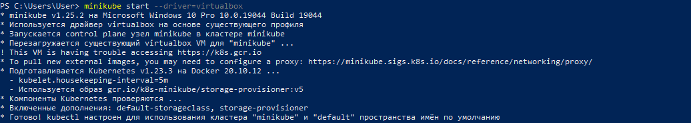

<!-- Описание -->
<details open="open">
  <summary>Описание</summary>
  <ol>
    <li>
      <a href="#Установите-minikube-согласно-инструкции-на-официальном-сайте">Установите minikube согласно инструкции на официальном сайте.</a>
    </li>
    <li>
      <a href="#Создайте-namespace-для-деплоя-простого-веб-приложения.">Создайте namespace для деплоя простого веб приложения.</a>
      <ul>
        <li><a href="#prerequisites">Prerequisites</a></li>
        <li><a href="#installation">Installation</a></li>
      </ul>
    </li>
    <li><a href="#usage">Usage</a></li>
    <li><a href="#roadmap">Roadmap</a></li>
    <li><a href="#contributing">Contributing</a></li>
    <li><a href="#license">License</a></li>
    <li><a href="#contact">Contact</a></li>
    <li><a href="#acknowledgements">Acknowledgements</a></li>
  </ol>
</details>


<!-- INSTALL MINIKUBE -->
## Установите minikube согласно инструкции на официальном сайте.
  1. Установка kubectl.
  2. Установка Гипервизора (Hyper-V, VirtualBox)
  3. Установка Minikube вручную.Загрузить minikube-windows-amd64, переименовать его в minikube.exe и добить его в директорию исполняемых файлов.
  4. Чтобы убедиться в том, что гипервизор и Minikube были установлены корректно, необохдимо выполнить следующую команду, которая запускает локальный кластер Kubernetes:
      ```sh
       minikube start --vm-driver=<driver_name>
      ```
      где --vm-driver=<enter_driver_name> - драйвер виртуальной машины.
  <p align="center">
  <a href="https://github.com/DmitryBond/WorkWithKubernetes/blob/main/images/start_kube.PNG">
    
  </a>
  <p align="center">
  
   5. После того, как команда minikube start отработала успешно, выполните команду для проверки состояния кластера:
      ```sh
      minikube status
      ```
      <p align="center">
  <a href="https://github.com/DmitryBond/WorkWithKubernetes/blob/main/images/minikube_status.PNG">
    
  </a>
  <p align="center">
    
      Кластер работает, minikube запущен.
    
    
   
<!-- CREATE NAMESPACE DEPLOY -->
## Создайте namespace для деплоя простого веб приложения.
    
