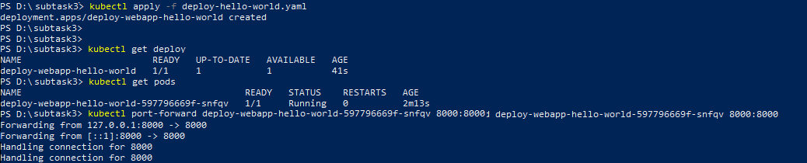

<!-- Описание -->
<details open="open">
  <summary>Описание</summary>
  <ol>
    <li>
      <a href="#Установите-minikube-согласно-инструкции-на-официальном-сайте">Установите minikube согласно инструкции на официальном сайте.</a>
    </li>
    <li>
      <a href="#Создайте-namespace-для-деплоя-простого-веб-приложения">Создайте namespace для деплоя простого веб приложения.</a>
    </li>
    <li><a href="#Напишите-deployments-файл-для-установки-в-Kubernetes-простого-веб-приложения">Напишите deployments файл для установки в Kubernetes простого веб приложения, например https://github.com/crccheck/docker-hello-world.</a></li>
    <li><a href="#Установите-в-кластер-ingress-контроллер">Установите в кластер ingress контроллер.</a></li>
    <li><a href="#Напишите-и-установите-Ingress-rule-для-получения-доступа-к-своему-приложению.">Напишите и установите Ingress rule для получения доступа к своему приложению.</a></li>
    <li><a href="#license">License</a></li>
    <li><a href="#contact">Contact</a></li>
    <li><a href="#acknowledgements">Acknowledgements</a></li>
  </ol>
</details>


<!-- INSTALL MINIKUBE -->
## Установите minikube согласно инструкции на официальном сайте.
  1. Установите kubectl.
  2. Установите Гипервизора (Hyper-V, VirtualBox)
  3. Установите Minikube вручную.Загрузить minikube-windows-amd64, переименовать его в minikube.exe и добить его в директорию исполняемых файлов.
  4. Убедитесь, что гипервизор и Minikube были установлены корректно. Для этого выполните следующую команду, которая запускает локальный кластер Kubernetes:
      ```sh
       minikube start --vm-driver=<driver_name>
      ```
      где --vm-driver=<enter_driver_name> - драйвер виртуальной машины.
  <p align="left">
  <a href="https://github.com/DmitryBond/WorkWithKubernetes/blob/main/images/start_kube.PNG">
    
  </a>
  <p align="left">
  
   5. После того, как команда minikube start отработала успешно, выполните команду для проверки состояния кластера:
      ```sh
      minikube status
      ```
      <p align="left">
  <a href="https://github.com/DmitryBond/WorkWithKubernetes/blob/main/images/minikube_status.PNG">
    
  </a>
  <p align="left">
    
      Кластер работает, minikube запущен.
    
    
   
<!-- CREATE NAMESPACE DEPLOY -->
## Создайте namespace для деплоя простого веб приложения.
    
  Создайте объект namespace  `web-namespace.yaml`
   ```JS
apiVersion: v1
kind: Namespace
metadata:
  name: webapp-nmsc
  labels:
    app: web
   ```
  <p align="left">
  <a href="https://github.com/DmitryBond/WorkWithKubernetes/blob/main/images/get_namespaces.PNG">
    
  </a>
  <p align="left">

    
<!-- FILE FOR INSTALL WEB -->    
## Напишите deployments файл для установки в Kubernetes простого веб приложения.
    
  Создайте файл манифеста для deployment `deploy-hello-world.yaml`
   ```JS
apiVersion: apps/v1
kind: Deployment
metadata:
  name: deploy-webapp-hello-world
  labels:
    app: web
spec:
  selector:
    matchLabels:
      project: dwhw
  template:
    metadata:  
      labels:
        project: dwhw
    spec:
      containers:
        - name: cont-hello-world
          image: crccheck/hello-world
          ports:
            - containerPort: 8000
   ```
 Запустите файл
    
  <p align="left">
  <a href="https://github.com/DmitryBond/WorkWithKubernetes/blob/main/images/deploy_hello_world.png">
    
  </a>
  <p align="left">
    
  Посмотрите на результат
  <p align="left">
  <a href="https://github.com/DmitryBond/WorkWithKubernetes/blob/main/images/result-hello-world.PNG">
    
  </a>
  <p align="left">
    
    
<!-- INSTALL INGRESS CONTROLLER -->
## Установите в кластер ingress контроллер.

  Включите входную надстройку для Minikube.
 
  ```sh
  minikube addons enable ingress
  ```
    
  <p align="left">
  <a href="https://github.com/DmitryBond/WorkWithKubernetes/blob/main/images/enable_ingress.png">
    
  </a>
  <p align="left">

    
<!-- WRITE AND INSTALL INGRESS RULE -->    
## Напишите и установите Ingress rule для получения доступа к своему приложению
    
    1. Создайте манифест `ingress-host-rule.yaml`, который определяет вход, отправляющтй трафик в службу.

   ```JS
apiVersion: v1
kind: Namespace
metadata:
  name: webapp-nmsc
  labels:
    app: web
   ```
  <p align="left">
  <a href="https://github.com/DmitryBond/WorkWithKubernetes/blob/main/images/get_namespaces.PNG">
    
  </a>
  <p align="left">

    
<!-- FILE FOR INSTALL WEB -->    
## Напишите deployments файл для установки в Kubernetes простого веб приложения.
    
  Создайте файл манифеста для deployment `deploy-hello-world.yaml`
   ```JS
apiVersion: networking.k8s.io/v1
kind: Ingress
metadata:
  name: webapp-hello-world-ingress
  namespaces: 
spec:
  rules:
  - host: hello-world.local
    http:
      paths:
      - path: /
        pathType: Prefix
        backend:
          service:
            name: web
            port:
              number: 8080
   ```
 2. Создайте объект Ingress
  ```sh
  kubectl apply -f deploy-hello-world.yaml
  ```
  Вывод должен быть:
  ```sh
  ingress.networking.k8s.io/webapp-hello-world-ingress configured
  ```
  3. Убедитесь, что IP-адрес установлен:
  ```sh
  kubectl get ingress
  ```
  <p align="left">
  <a href="https://github.com/DmitryBond/WorkWithKubernetes/blob/main/images/get_ingress.png">
    
  </a>
  <p align="left">
    
  4. Добавьте строку в конец /etc/hosts файла на вашем компьютере:
  ```sh
      ADDRESS         HOSTS
  192.168.59.101 hello-world.local 
  ```
